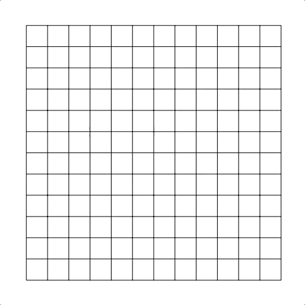
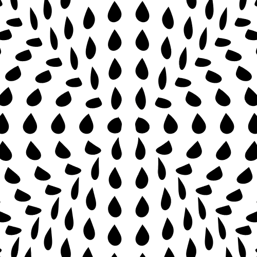

# Circle Grid
A bunch of code-art things around the concept of mapping squares to circles

There's three creations here that all come from the same source code. The code for each are on different branches.

This uses my [es6-base](https://github.com/Jezzamonn/es6-base) project as the base

## Square Circle

[jezzamon.com/circle-checkerboard](http://www.jezzamon.com/circle-checkerboard)

Source code: https://github.com/Jezzamonn/circle-grid/tree/just-lines

## Ink Tears

[jezzamon.com/circle-checkerboard](http://www.jezzamon.com/circle-checkerboard)

Source code: https://github.com/Jezzamonn/circle-grid/tree/crying

## Circle Checkerboard

[jezzamon.com/circle-checkerboard](http://www.jezzamon.com/circle-checkerboard)

Source code: https://github.com/Jezzamonn/circle-grid/tree/circle-checkerboard
